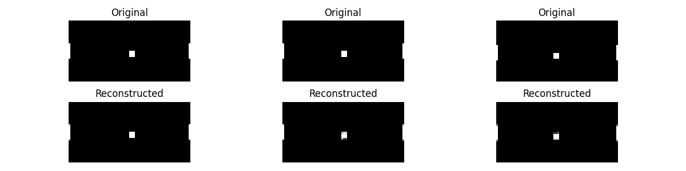
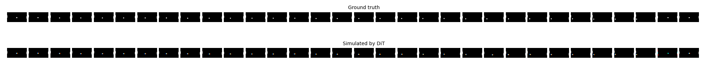

# hPong (WIP)

## Doing:

VAE:

- [?] Split each frame into its own VAE encoding/decoding.
  Right now, the VAE is encoding/decoding 3 frames at once, which is not flexible.
  (Done, just needs testing)

DiT:

- [ ] Read up on rotary position embeddings in transformers, look at example implementations
  - [ ] implement **spacial** position embedding using rope
  - [ ] implement **temporal** position embedding using rope

## Todo:

- [ ] Figure out why KL divergence of the DiT is so high (in the 9 orders of magnitude)
- [ ] guidance for user actions on DiT (STGuidance)

# References

- [RoPE: Rotary Position Embedding](https://arxiv.org/pdf/2104.09864v5)
- [Spatiotemporal Skip Guidance](https://arxiv.org/pdf/2411.18664#page=9&zoom=100,84,296)
- [Axial Attention](https://arxiv.org/pdf/1912.12180)
